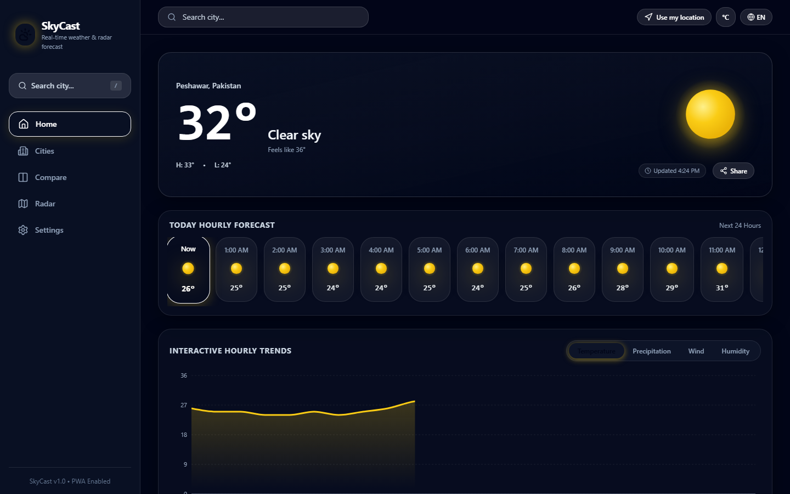
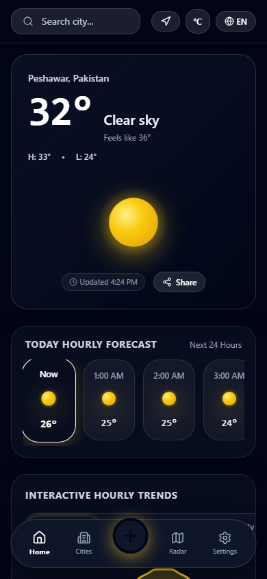
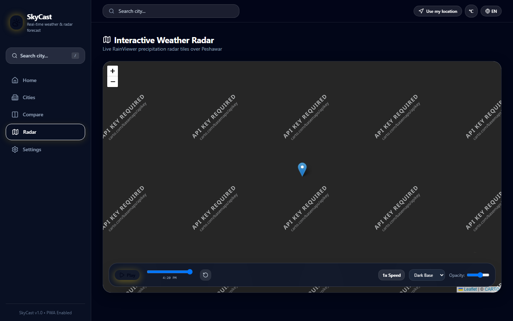
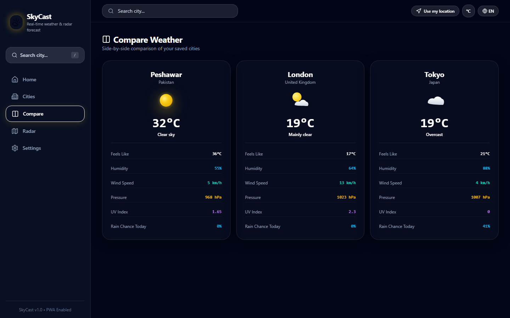
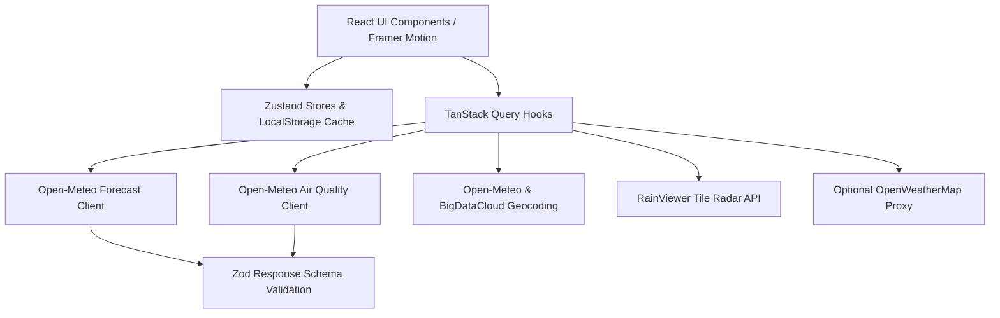

<div align="center">

# 🌤️ SkyCast Weather Web App

**Production-Grade, Installable (PWA) Glassmorphic Weather & Live Radar Application**

[](https://github.com/username/skycast/actions)
[](LICENSE)
[](https://react.dev)
[](https://www.typescriptlang.org)
[](https://tailwindcss.com)
[](CONTRIBUTING.md)

[🔴 Live Demo](https://skycast-weather-app.vercel.app) • [✨ Features](#-features) • [🧰 Tech Stack](#-tech-stack) • [⚙️ Getting Started](#️-getting-started) • [🚀 Deployment](#-deployment-guide)

</div>

---

## 📸 Screenshots

| 🖥️ Desktop Dashboard | 📱 Mobile PWA View |
| :---: | :---: |
|  |  |

| 🛰️ Live RainViewer Radar | 📊 Side-by-Side City Comparison |
| :---: | :---: |
|  |  |

---

## ✨ Features

- **🎨 Modern Glassmorphic Design System**: Backdrop blur, translucent 1px borders, smooth radial gradients, warm yellow (`#FACC15`) CTA highlights, and 3D weather illustrations.
- **⚡ Dynamic Condition & Time-Based Themes**: Automatically adapts background colors and animated weather particle effects (`clear-day`, `clear-night`, `cloudy`, `rain`, `snow`, `thunderstorm`, `fog`).
- **📱 Progressive Web App (PWA)**: Offline support with Service Worker precaching, installable on mobile/desktop, and cached data fallback notice.
- **📍 Geolocation Auto-Detection**: Instant location detection with reverse geocoding fallback to default location.
- **⏰ Hourly & 7/14-Day Forecasts**: Active "Now" hour pill highlight, min/max visual temperature range bars, rain chance percentages, and detailed day view modal.
- **🩺 Health & Environment Metrics**: Air Quality Index (AQI) with pollutant breakdown (PM2.5, PM10, O3, NO2, SO2, CO), UV Index gauge, and SunArc sunrise/sunset progression arc.
- **📊 Interactive Recharts**: Tabs for temperature, precipitation probability, wind speed, and humidity with glass tooltips.
- **🗺️ Interactive Live Precipitation Radar**: Animated RainViewer tiles overlay on Leaflet map with play/pause timeline slider, playback speed, and opacity controls.
- **👗 Smart Wear Advice & Activity Engine**: Transparent rule-based clothing recommendations (umbrella, coat, sunscreen) and activity scores (running, dining, stargazing).
- **🗣️ Natural Language Daily Summary**: Automated human-readable daily weather summary builder.
- **🔎 City Search & Favorites**: Debounced autocomplete search (300ms), keyboard navigation (`/` shortcut), recent searches, and saved cities grid.
- **⚔️ Compare Mode**: Side-by-side comparison of 2-3 cities across key metrics.
- **🌍 Internationalization (i18n)**: Full English and Urdu support with dynamic RTL layout (`dir="rtl"`).

---

## 🧰 Tech Stack

| Layer | Technology |
| :--- | :--- |
| **Framework & Language** | Vite, React 19, TypeScript (Strict Mode) |
| **Routing & State** | React Router v7, Zustand (persisted state), TanStack Query v5 |
| **Styling & Animations** | Tailwind CSS v4, Framer Motion, Lucide React Icons |
| **Charts & Maps** | Recharts, Leaflet, react-leaflet, RainViewer API |
| **Data & Validation** | Zod (API payload validation), date-fns, date-fns-tz |
| **PWA & Offline** | vite-plugin-pwa, Workbox Service Worker |
| **Internationalization** | i18next, react-i18next (English & Urdu RTL) |
| **Testing & Tooling** | Vitest, React Testing Library, Playwright E2E, ESLint, Prettier |

---

## 🌐 APIs Used

| API Name | Endpoint / Purpose | Key Required? | Attribution / Limits |
| :--- | :--- | :---: | :--- |
| **Open-Meteo Forecast** | `api.open-meteo.com/v1/forecast` | ❌ No | Non-commercial free tier ([Open-Meteo](https://open-meteo.com/)) |
| **Open-Meteo Air Quality** | `air-quality-api.open-meteo.com/v1/air-quality` | ❌ No | Free AQI & pollutant data |
| **Open-Meteo Geocoding** | `geocoding-api.open-meteo.com/v1/search` | ❌ No | City search autocomplete |
| **BigDataCloud Geocoding** | `api.bigdatacloud.net/data/reverse-geocode-client` | ❌ No | Free client reverse geocoding |
| **RainViewer Radar** | `api.rainviewer.com/public/weather-maps.json` | ❌ No | Free precipitation radar tiles ([RainViewer](https://www.rainviewer.com/)) |
| **Carto / OpenStreetMap** | `cartocdn.com`, `openstreetmap.org` | ❌ No | Base map tiles with attribution |
| **OpenWeatherMap (Optional)**| `api.openweathermap.org/data/2.5/onecall` | ⚠️ Optional | Used for official severe alerts when key is provided in `.env` |

---

## 🏗️ Project Architecture



```
skycast/
├── .github/workflows/ci.yml
├── api/
│   └── owm.ts
├── docs/screenshots/
│   ├── desktop_home.png
│   ├── mobile_home.png
│   ├── radar_map.png
│   └── compare_cities.png
├── public/
│   └── favicon.ico
├── src/
│   ├── app/
│   │   ├── App.tsx
│   │   ├── router.tsx
│   │   └── providers.tsx
│   ├── components/
│   │   ├── ui/ (Card, Button, Skeleton, Modal, Tabs, Toggle)
│   │   ├── weather/ (HeroSection, HourlyStrip, DailyList, DetailsGrid, AQICard, UVCard, SunArcCard, RainCard, MoonCard)
│   │   ├── charts/ (WeatherChart)
│   │   ├── map/ (RadarMap)
│   │   ├── effects/ (WeatherEffects)
│   │   └── layout/ (Header, Sidebar, BottomNav)
│   ├── features/ (search, onboarding, alerts, advice)
│   ├── i18n/ (index.ts, en.json, ur.json)
│   ├── lib/ (weatherCodes, unitConversion, moonPhase, adviceEngine, alertsEngine, formatters)
│   ├── pages/ (Home, Cities, Compare, Radar, Settings, NotFound)
│   ├── services/ (weatherApi, airQualityApi, geocodingApi, radarApi, owmApi, schemas)
│   ├── store/ (useWeatherStore, useSettingsStore, useOnboardingStore)
│   ├── env.ts
│   ├── index.css
│   └── main.tsx
├── tests/
│   ├── setup.ts
│   ├── unit/ (weatherCodes, unitConversion, moonPhase, adviceEngine, formatters, AQICard)
│   └── e2e/ (app.spec.ts)
├── .env.example
├── vercel.json
├── netlify.toml
└── README.md
```

---

## ⚙️ Getting Started

### Prerequisites
- Node.js 18.x or 20.x installed
- npm 9+ or yarn

### Installation Steps

1. **Clone repository:**
   ```bash
   git clone https://github.com/username/skycast.git
   cd skycast
   ```

2. **Install dependencies:**
   ```bash
   npm install
   ```

3. **Copy environment variables template:**
   ```bash
   cp .env.example .env
   ```

4. **Start local development server:**
   ```bash
   npm run dev
   ```
   Open `http://localhost:3000` in your browser.

---

## 🔐 Environment Variables

| Variable Name | Type | Required? | Default Value | Description |
| :--- | :---: | :---: | :--- | :--- |
| `VITE_APP_NAME` | String | Optional | `SkyCast` | Application brand name |
| `VITE_DEFAULT_CITY` | String | Optional | `Peshawar` | Fallback default city |
| `VITE_DEFAULT_LAT` | Number | Optional | `34.0151` | Fallback default latitude |
| `VITE_DEFAULT_LON` | Number | Optional | `71.5249` | Fallback default longitude |
| `VITE_OWM_API_KEY` | String | Optional | `undefined` | Optional OpenWeatherMap API key for severe alerts |

> 🔒 **Security Note**: Variables prefixed with `VITE_` are exposed to the browser. Never place private secret keys directly in client `.env`. Use the provided Vercel Serverless Function Proxy (`api/owm.ts`) for server-side secret handling.

---

## 🚀 Deployment Guide

### Deploying to Vercel

1. Install Vercel CLI or connect your GitHub repository in the [Vercel Dashboard](https://vercel.com).
2. Build Command: `npm run build`
3. Output Directory: `dist`
4. The included `vercel.json` automatically configures SPA rewrites and security headers (`X-Content-Type-Options`, `X-Frame-Options`, `Referrer-Policy`).

### Deploying to Netlify

1. Connect your repository in [Netlify Console](https://app.netlify.com).
2. Build Command: `npm run build`
3. Publish Directory: `dist`
4. The included `netlify.toml` automatically configures single-page application redirects and security headers.

---

## 🧪 Testing & Scripts

| Command | Description |
| :--- | :--- |
| `npm run dev` | Starts Vite local development server on port 3000 |
| `npm run typecheck` | Runs TypeScript type checker (`tsc --noEmit`) |
| `npm run test` | Executes Vitest unit and component tests |
| `npm run test:e2e` | Runs Playwright end-to-end browser tests |
| `npm run build` | Compiles TypeScript and creates optimized PWA build |
| `npm run preview` | Previews production build bundle locally |
| `npm run format` | Formats code with Prettier |

---

## ♿ Accessibility & 🌍 i18n

- **Accessibility (a11y)**: Built with semantic HTML5 elements, ARIA dialog roles, focus rings, high contrast text ratios (WCAG AA compliant), and respects `prefers-reduced-motion` for canvas background animations.
- **Keyboard Navigation**: Press `/` anywhere in the app to open the city search modal. Use Arrow Keys to navigate autocomplete results and press Enter to select.
- **Localization**: Supports English and Urdu (`ur`) with dynamic `dir="rtl"` page layout orientation.

---

## 🗺️ Roadmap & Contributing

- [x] Initial Release with PWA, Open-Meteo, RainViewer Radar, and Glassmorphism design system.
- [ ] Add 3D WebGL interactive globe view for global city selection.
- [ ] Push notification service worker integration for hourly precipitation warnings.

Contributions are welcome! Please review our [Contributing Guidelines](CONTRIBUTING.md) and [Code of Conduct](CODE_OF_CONDUCT.md).

---

## 📄 License & Acknowledgements

This project is licensed under the [MIT License](LICENSE).

### Credits & Data Providers
- Weather & AQI data provided by [Open-Meteo](https://open-meteo.com/).
- Live Radar tiles provided by [RainViewer](https://www.rainviewer.com/).
- Base map tiles by [CARTO](https://carto.com/) and [OpenStreetMap](https://www.openstreetmap.org/).
# Weather-App

