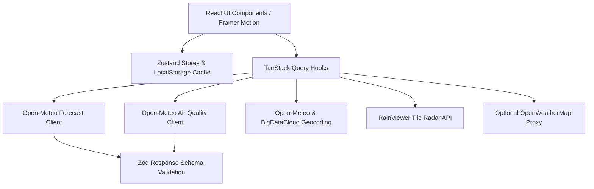

<div align="center">

# 🌤️ SkyCast Weather Web App

**Production-Grade, Installable (PWA) Glassmorphic Weather & Live Radar Application**

[](https://github.com/username/skycast/actions)
[](https://react.dev)
[](https://www.typescriptlang.org)
[](https://tailwindcss.com)
[](https://vitejs.dev)
[](LICENSE)
[](CONTRIBUTING.md)

[🔴 Live Demo](https://skycast-weather-app.vercel.app) • [✨ Features](#-features) • [🧰 Tech Stack](#-tech-stack) • [🏗️ Architecture](#-project-architecture) • [⚙️ Getting Started](#-getting-started) • [🚀 Deployment](#-deployment-guide)

</div>

---

## 📌 Overview

**SkyCast** is a modern, high-performance, glassmorphic weather web application built with React 19, TypeScript, and Tailwind CSS. It delivers real-time weather forecasts, interactive live precipitation radar maps, detailed air quality metrics, smart wear advice, multi-city comparisons, and full offline Progressive Web App (PWA) support.

---

## 📸 Screenshots

| 🖥️ Desktop Dashboard | 📱 Mobile PWA View |
| :---: | :---: |
|  |  |

| 🛰️ Live RainViewer Radar | 📊 Side-by-Side City Comparison |
| :---: | :---: |
|  |  |

---

## ✨ Features

### 🎨 Design & Visual Experience
- **Glassmorphic UI**: Translucent backdrop blur, 1px frosted borders, soft radial gradients, warm yellow highlights, and custom weather visual indicators.
- **Dynamic Themes & Particle Effects**: Automatically adjusts color palettes and canvas background animations based on atmospheric conditions and time of day (`clear-day`, `clear-night`, `cloudy`, `rain`, `snow`, `thunderstorm`, `fog`).

### 🌤️ Weather Forecasts & Environmental Metrics
- **Hourly & Multi-Day Forecasts**: Active hour pill highlighting, interactive temperature range bars, rain probability badges, and detailed day view modal.
- **Air Quality Index (AQI)**: Breakdown of key atmospheric pollutants (PM2.5, PM10, O3, NO2, SO2, CO) with color-coded health risk gauges.
- **Sun & Moon Arc Tracking**: Visual sunrise/sunset progression arc and real-time lunar phase visualization.
- **Natural Language Summary**: Automated human-readable daily weather summary builder.

### 🗺️ Interactive Maps & Analytics
- **Live RainViewer Precipitation Radar**: Interactive Leaflet map with animated precipitation tiles, play/pause controls, timeline scrubber, speed options, and layer opacity.
- **Interactive Recharts**: Tabbed visual charts for temperature curves, precipitation likelihood, wind velocity, and humidity.

### 👗 Smart Engine & Productivity
- **Clothing & Activity Recommendations**: Rule-based smart clothing suggestions (umbrella, coat, sunscreen) alongside outdoor activity suitability scores (running, dining, stargazing).
- **Search & Multi-City Comparison**: 300ms debounced autocomplete search, saved favorites list, keyboard shortcut (`/`), and side-by-side metric comparisons for 2–3 cities.

### 📱 Performance, PWA & Globalization
- **Progressive Web App (PWA)**: Full offline capability powered by Service Worker precaching and cached data fallback notices.
- **Geolocation & Auto-Detect**: Instant location identification with reverse geocoding fallback.
- **Multilingual (i18n)**: English and Urdu support with seamless right-to-left (`dir="rtl"`) layout orientation.

---

## 🧰 Tech Stack

| Domain | Technology | Purpose |
| :--- | :--- | :--- |
| **Core Framework** | Vite, React 19, TypeScript | Build environment, reactive UI rendering, strict type checking |
| **State & Routing** | Zustand, TanStack Query v5, React Router v7 | Global state persistence, API data fetching/caching, client routing |
| **Styling & Motion** | Tailwind CSS v4, Framer Motion, Lucide React | Glassmorphic design system, smooth UI micro-interactions, icons |
| **Charts & Maps** | Recharts, Leaflet, react-leaflet | Weather data visualization, live interactive radar tiles |
| **Data & Validation**| Zod, date-fns, date-fns-tz | Runtime API schema validation, date & timezone formatting |
| **PWA & Offline** | vite-plugin-pwa, Workbox | Service Worker caching, installable web application manifest |
| **Localization** | i18next, react-i18next | Multilingual support (English & Urdu RTL) |
| **Quality & Testing**| Vitest, React Testing Library, Playwright, ESLint | Unit testing, integration testing, end-to-end browser automation |

---

## 🌐 Weather Data & External APIs

| API Name | Endpoint / Purpose | Key Required? | Attribution / Tier |
| :--- | :--- | :---: | :--- |
| **Open-Meteo Forecast** | `api.open-meteo.com/v1/forecast` | ❌ No | Free non-commercial forecast tier ([Open-Meteo](https://open-meteo.com/)) |
| **Open-Meteo Air Quality** | `air-quality-api.open-meteo.com/v1/air-quality` | ❌ No | Free atmospheric AQI and pollutant data |
| **Open-Meteo Geocoding** | `geocoding-api.open-meteo.com/v1/search` | ❌ No | City search autocomplete service |
| **BigDataCloud Geocoding** | `api.bigdatacloud.net/data/reverse-geocode-client` | ❌ No | Free client-side reverse geocoding |
| **RainViewer Radar** | `api.rainviewer.com/public/weather-maps.json` | ❌ No | Free precipitation radar tiles ([RainViewer](https://www.rainviewer.com/)) |
| **Carto / OpenStreetMap** | `cartocdn.com`, `openstreetmap.org` | ❌ No | Dark & light vector base map tile layers |
| **OpenWeatherMap** | `api.openweathermap.org/data/2.5/onecall` | ⚠️ Optional | Serverless proxy for severe weather alerts when configured |

---

## 🏗️ Project Architecture

### Data Flow Diagram



### Directory Hierarchy

```text
skycast/
├── .github/
│   └── workflows/
│       └── ci.yml             # GitHub Actions CI pipeline
├── api/
│   └── owm.ts                 # Serverless proxy for OpenWeatherMap alerts
├── docs/
│   └── screenshots/           # Application screenshots for documentation
├── public/                    # Static public assets & icons
├── src/
│   ├── app/                   # App root, router, and context providers
│   ├── components/            # UI components, weather cards, charts, maps, effects
│   ├── features/              # Search, onboarding, alerts, advice modules
│   ├── i18n/                  # Localization setup and translation files (en/ur)
│   ├── lib/                   # Utility helpers, unit conversions, algorithms
│   ├── pages/                 # Route views (Home, Cities, Compare, Radar, Settings)
│   ├── services/              # API clients and Zod schema validations
│   ├── store/                 # Zustand state stores (weather, settings, onboarding)
│   ├── env.ts                 # Environment variable validation
│   ├── index.css              # Global styles & Tailwind CSS configuration
│   └── main.tsx               # Application entry point
├── tests/                     # Unit, integration, and E2E Playwright test suites
├── .env.example               # Template environment configuration
├── netlify.toml               # Netlify hosting configuration
├── vercel.json                # Vercel hosting & rewrite configuration
└── README.md                  # Project documentation
```

---

## ⚙️ Getting Started

### Prerequisites

Ensure you have the following software installed locally:
- **Node.js**: `v18.x` or `v20.x`
- **npm**: `v9.x` or higher (or `yarn` / `pnpm`)

### Installation & Setup

1. **Clone the repository:**
   ```bash
   git clone https://github.com/username/skycast.git
   cd skycast
   ```

2. **Install project dependencies:**
   ```bash
   npm install
   ```

3. **Configure environment variables:**
   ```bash
   cp .env.example .env
   ```

4. **Launch local development server:**
   ```bash
   npm run dev
   ```
   Open your browser and navigate to `http://localhost:3000`.

---

## 🔐 Environment Variables

| Variable Name | Type | Required? | Default Value | Description |
| :--- | :---: | :---: | :--- | :--- |
| `VITE_APP_NAME` | `string` | Optional | `SkyCast` | Display brand name used across the interface |
| `VITE_DEFAULT_CITY` | `string` | Optional | `Peshawar` | Default location fallback for weather data |
| `VITE_DEFAULT_LAT` | `number` | Optional | `34.0151` | Fallback default latitude coordinates |
| `VITE_DEFAULT_LON` | `number` | Optional | `71.5249` | Fallback default longitude coordinates |
| `VITE_OWM_API_KEY` | `string` | Optional | `undefined` | Key for OpenWeatherMap severe weather alerts |

> 🔒 **Security Notice**: Client-side environment variables prefixed with `VITE_` are bundled into client JavaScript. Do not commit secret keys. Use serverless proxies (such as `api/owm.ts`) for secure server-side execution.

---

## 🛠️ CLI Scripts & Commands

| Script | Command | Purpose |
| :--- | :--- | :--- |
| **Development** | `npm run dev` | Launches Vite local development server on port 3000 |
| **Type Checking**| `npm run typecheck` | Validates TypeScript types across project (`tsc --noEmit`) |
| **Unit Testing** | `npm run test` | Runs Vitest unit & component test suite |
| **E2E Testing** | `npm run test:e2e` | Executes Playwright end-to-end tests in headless browsers |
| **Linting** | `npm run lint` | Analyzes code quality using ESLint |
| **Formatting** | `npm run format` | Auto-formats code with Prettier |
| **Production Build**| `npm run build` | Compiles TypeScript and creates optimized PWA build bundle |
| **Build Preview** | `npm run preview` | Serves production build locally for verification |

---

## 🚀 Deployment Guide

### Deploying to Vercel

1. Import your GitHub repository into the [Vercel Dashboard](https://vercel.com).
2. Set **Build Command**: `npm run build`
3. Set **Output Directory**: `dist`
4. The repository includes `vercel.json` for single-page app (SPA) routing rules and security headers (`X-Content-Type-Options`, `X-Frame-Options`, `Referrer-Policy`).

### Deploying to Netlify

1. Connect your repository on the [Netlify Console](https://app.netlify.com).
2. Set **Build Command**: `npm run build`
3. Set **Publish Directory**: `dist`
4. The repository includes `netlify.toml` for automatic SPA redirection rules and custom headers.

---

## ♿ Accessibility & 🌍 Localization

- **Accessibility (a11y)**: Compliant with WCAG AA guidelines using semantic HTML5 elements, ARIA dialog roles, explicit focus rings, high text contrast ratios, and `prefers-reduced-motion` detection for ambient background animations.
- **Keyboard Navigation**: Press `/` anywhere in the app to open global city search. Use `Up` / `Down` arrows to navigate autocomplete suggestions and `Enter` to select.
- **Localization (i18n)**: Fully supports English (`en`) and Urdu (`ur`) with dynamic right-to-left layout adaptation (`dir="rtl"`).

---

## 🗺️ Project Roadmap

- [x] Initial release featuring PWA support, Open-Meteo integration, RainViewer precipitation radar, and Glassmorphic design system.
- [x] Multi-city side-by-side comparison mode and AQI pollutant breakdown.
- [ ] Add 3D WebGL interactive globe for global location selection.
- [ ] Push notification service worker integration for hourly precipitation warnings.

---

## 📄 License & Acknowledgements

This project is open-source software licensed under the [MIT License](LICENSE).

### Data Provider Credits
- Weather & AQI data provided by [Open-Meteo](https://open-meteo.com/).
- Live precipitation radar tiles provided by [RainViewer](https://www.rainviewer.com/).
- Base map tiles provided by [CARTO](https://carto.com/) and [OpenStreetMap](https://www.openstreetmap.org/).